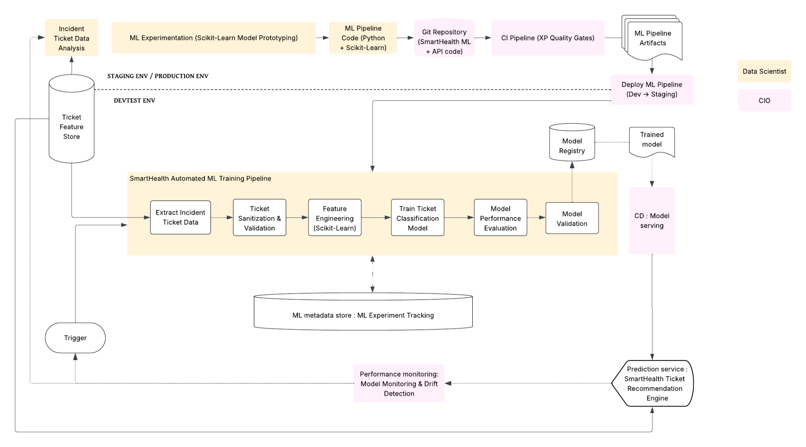

# SmartHealth — Integrating Machine Learning into CI/CD

A software project management case study exploring how a fictional healthcare IT consultancy could introduce **scikit-learn–assisted ticket triage** through an existing DevOps delivery process.

The team took a research-lab approach: experiment with machine learning in a research environment, transfer validated models and pipelines to engineering, and manage releases through CI quality gates, staging, production promotion, and monitoring.

**Project status:** academic research, architecture, and delivery planning. This repository contains the team's documentation and diagrams, with a curated reading guide. The supplied materials do not include executable training code, CI/CD configuration, deployment logs, or measured model results. Business benefits are scenario estimates and targets.

## The business problem

SmartHealth is a roleplay consultancy of approximately 80–100 employees supporting hospitals and clinics. Its existing service platform uses Salesforce for support cases and service-level tracking. Tier-1 staff manually interpret ticket descriptions, assign category and urgency, and choose a resolution path. The proposed automation adds machine learning assistance to that workflow while keeping consultants responsible for final decisions.

## What this project showcases

- Selecting an OSS component for a defined business problem and examining alternatives.
- Connecting research experimentation with DevOps and MLOps responsibilities.
- Designing a training, validation, model registry, serving, and monitoring lifecycle.
- Planning controlled releases through feature and ML experiment branches.
- Translating personas into user stories, sprint milestones, test criteria, and risk controls.
- Evaluating an automation business case while documenting assumptions and limitations.

## Start here

| Document | What it covers |
|---|---|
| [Project report](docs/project-report.md) | Company context, research approach, architecture, and conclusions |
| [Pipeline and release design](docs/pipeline-and-releases.md) | Original diagrams, CI/CD integration, ownership, and testing |
| [OSS research](docs/oss-research.md) | Why the team chose scikit-learn and how alternatives were considered |
| [Delivery plan](docs/delivery-plan.md) | Personas, 13-story scope, four proposed sprints, and retrospectives |
| [Business case and evidence limits](docs/business-case.md) | Scenario inputs, conflicting ROI figures, and unresolved assumptions |
| [Original document index](docs/source-index.md) | Eight retained source documents and their context |

## ML pipeline design



Extracted unchanged from the team's DevOps/MLOps workflow document. It describes the proposed operating model; it is not a record of a deployed system.

## Team

Trupti Lone · Aryan Puranik · Maheshwari Bhandare · Senit Ghile 

Course context: ISBA 2408 OSS project. SmartHealth, its staff personas, customer scenarios, service volumes, and financial projections are part of the academic simulation. The project is about applying an OSS library; it does not claim contributions to the upstream scikit-learn project.

## Repository contents

```text
assets/diagrams/       Original figures extracted from team documents
docs/                 Curated Markdown report and supporting guides
docs/originals/        Essential source documents, retained unchanged
```

Original documents preserve the team's historical wording, including draft claims and inconsistent estimates. Use the curated guides for the current portfolio framing. No license has been assigned to the team's documents; scikit-learn's license does not automatically license this collection.
