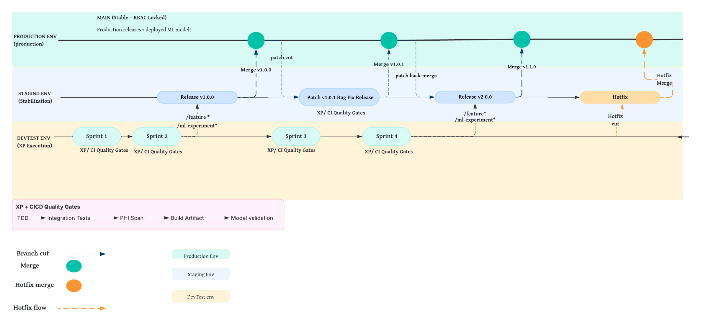

# Pipeline and release design

This guide explains the architecture documented by the team. All stages below describe the proposed SmartHealth operating model; no pipeline execution was verified from the supplied files.

## Research, training, and serving

| Stage | Documented purpose |
|---|---|
| Research | Analyze historical incidents and prototype scikit-learn models |
| Source control and CI | Version ML/API code, run XP quality gates, and produce pipeline artifacts |
| Data preparation | Extract ticket records, sanitize and validate text, and engineer features |
| Training and evaluation | Train ticket classifiers and validate performance |
| Registry and metadata | Record model versions and experiment information |
| Delivery | Promote the approved model into the prediction service |
| Monitoring | Observe performance and drift and trigger further training |

The research team owns experimentation and model validation; the engineering organization owns CI/CD infrastructure, environment promotion, and production operation. Exact infrastructure products for the registry, experiment tracking, or CI runner are not established by executable configuration in this collection.

## Release workflow

The source diagram maps Scrum sprints and XP quality gates onto three environments. Feature and ML experiment branches feed staging releases. Validated releases merge into the protected main line. Patch and hotfix paths support changes after release.

**Source annotation:** the diagram labels a staging release `v2.0.0` but its corresponding main-line merge `v1.1.0`. The original image is preserved unchanged; that mismatch must be resolved if this design becomes an implementation specification.

## Proposed quality gates and tests

| Area | Target in the workflow document | Validation approach described |
|---|---|---|
| Sanitization | Mask all detected PHI; reject unsanitized ML input | Synthetic identifiers and sanitization checks |
| Model quality | At least 80% classification accuracy | Cross-validation and holdout evaluation |
| Triage effort | At least 30% reduction | Baseline versus assisted workflow benchmark |
| Routing | At least 30% reduction in misrouting | Historical comparison and routing scenarios |
| Critical response | At least 25% improvement | Priority and escalation scenarios |
| Confidence | Flag all low-confidence recommendations | Boundary tests around configured thresholds |
| Human control | Advisory recommendations; logged accept/reject decisions | Functional and state-transition tests |
| Auditability | Record relevant actions with user and time | Log completeness and traceability checks |
| Release readiness | No critical defects | Regression, integration, and monitoring tests |

These are planning requirements. Masking everything a detector finds does not demonstrate that it found every sensitive item. Overall accuracy alone also does not establish reliable performance on critical-ticket classes. Those limitations remain evaluation questions, not resolved project results.

The test plan describes synthetic tickets, sanitized historical records, incomplete descriptions, ambiguous routing, simulated decisions, and confidence boundary cases. No underlying datasets, test suites, or result files are present in this collection.

## Earlier architecture and organizational context

[Earlier ML lifecycle diagram](../assets/diagrams/early-ml-lifecycle.png) and [organization structure](../assets/diagrams/organization-structure.png) were extracted from the annotated draft report. They preserve the evolution of the team's design. Use the later workflow document as the primary source for the integrated pipeline.

Source: [DevOps/MLOps, release management, and testing document](originals/devops-mlops-release-and-testing.docx). The source images were extracted directly without redrawing or changing labels.
